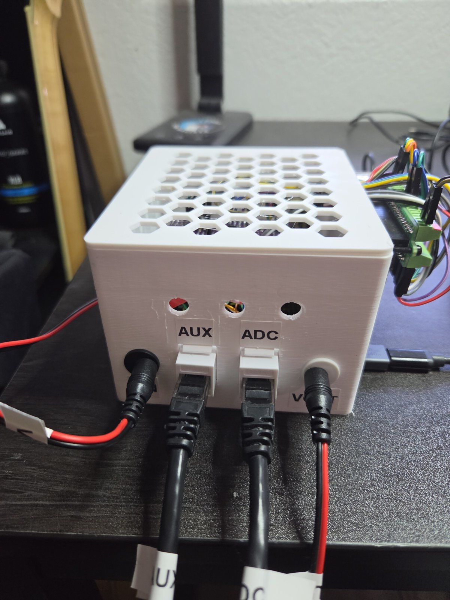
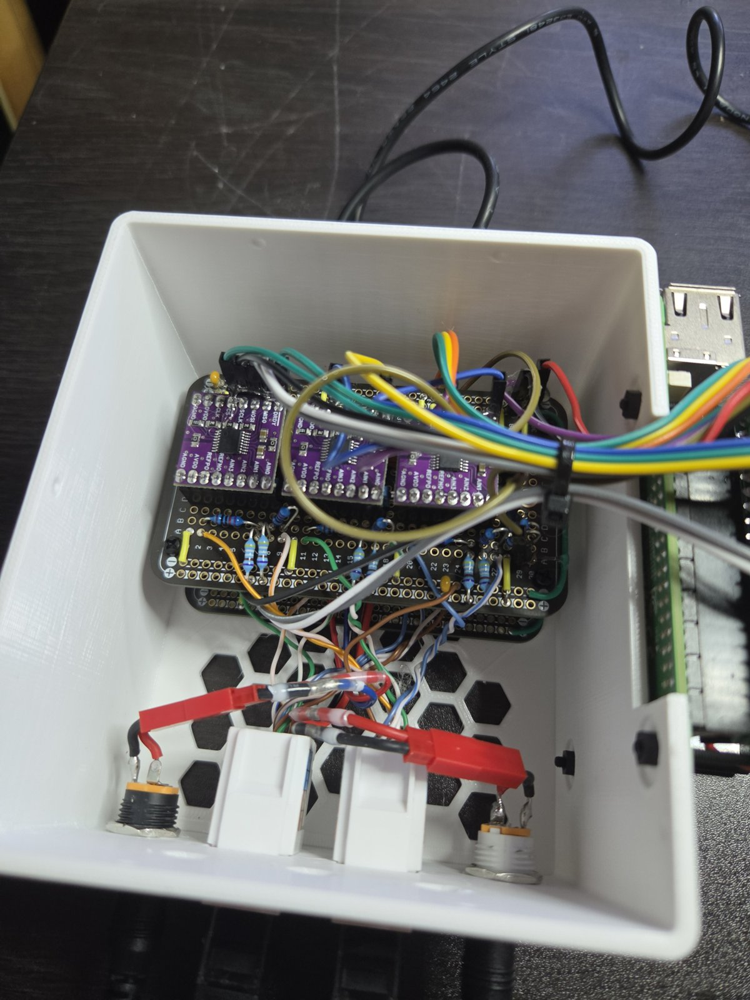
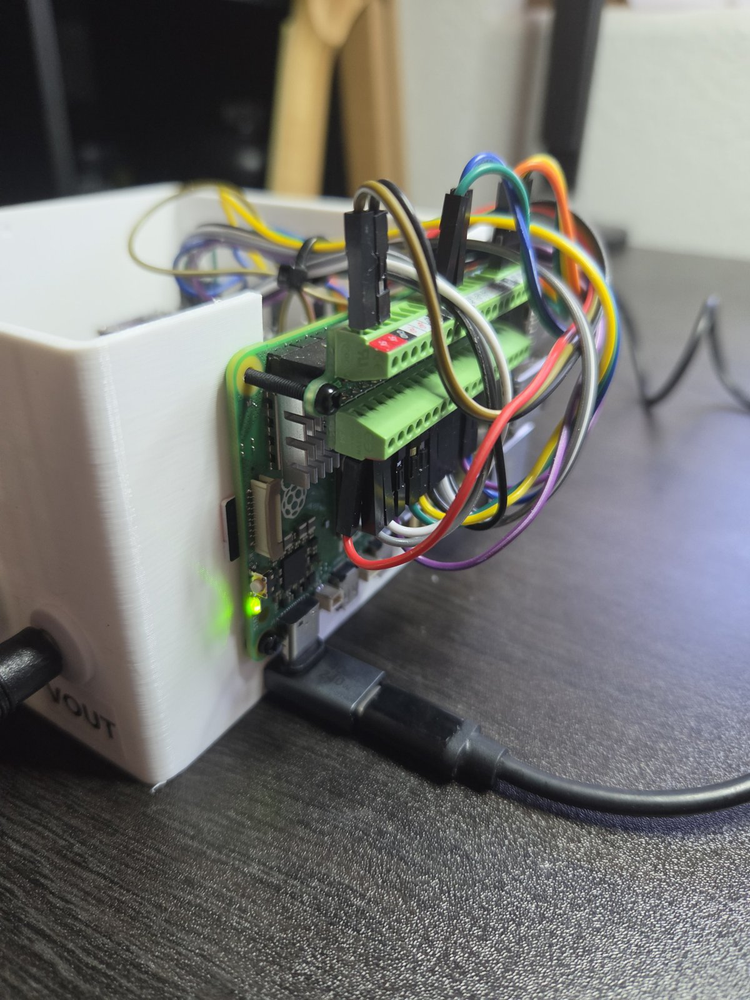
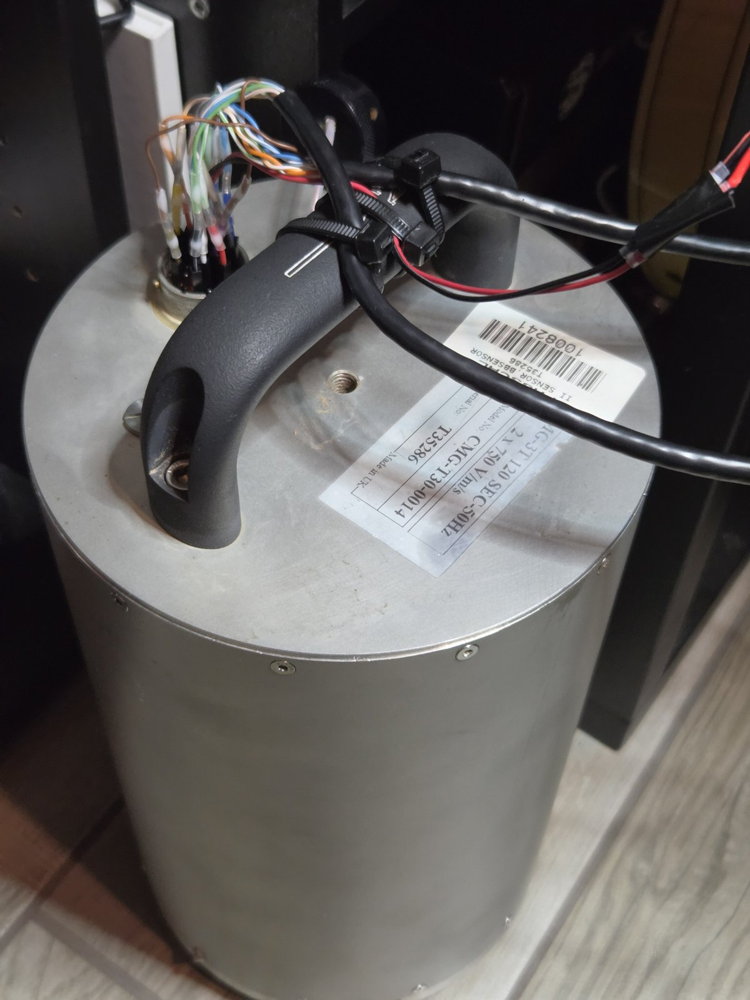

# CMG-3T Digitizer And Control System

A three-component digitizer for a Güralp CMG-3T 120 s broadband seismometer:
three ADS1220s for velocity and an ADS1115 for the mass positions, on two
ElectroCookie solderable breadboards, read by a Raspberry Pi 5 that also
locks, unlocks and centres the masses. 0.489 nm/s per count, ±4.1 mm/s full
scale, ~1.5 nm/s/√Hz floor, 100 SPS miniSEED.

**`cmg3t-digitizer.html`** is the build document: block diagram, parts list
with DigiKey numbers, both board layouts hole by hole, the sensor cable table,
the Pi wiring, and the assembly and test stages.
**[Read it here](https://rankinstudio.github.io/CMG-3T-Digitizer-And-Control-System/cmg3t-digitizer.html)** (GitHub's file view shows only
the source).

Companion project: [DIY-SEISMO](https://github.com/rankinstudio/DIY-SEISMO), a
geophone station built the same way; the shared stream format and capture core
come from it.

| Path | What |
|---|---|
| `cmg3t-digitizer.html` | Build document |
| `connector_pinface.png` | The sensor's 26-pin connector, pin letters from the pin face |
| `pi/` | Pi software: capture daemon, mass control, bring-up checks ([README](pi/README.md)) |
| `enclosure/` | 3D-printed box for the boards with the Pi on its side ([README](enclosure/README.md)) |
| `pc/` | PC viewer (Z/N/E traces and spectrograms in three bands) and earthquake plots ([README](pc/README.md)) |

## About the sensor

**History.** Güralp Systems, of Reading in England, launched the 3T in the
mid-1980s: the company dates it to 1985, and it has been in continuous
production since 1987. It was the first field-worthy three-component broadband
feedback seismometer, and more than 3000 have been deployed worldwide. It
became a standard sensor for national seismic networks and for the
instrument pools that lend seismometers to university experiments, above all
the US PASSCAL pool, which also bought cold-rated 3Ts for Antarctica. From 2004
it was one of the three broadband sensors of EarthScope's USArray
Transportable Array, alongside the Streckeisen STS-2 and the Nanometrics
Trillium 240: a grid of about 400 stations, 70 km apart, that rolled across
the lower 48 states from 2004 to 2015 (1679 sites in all), then Alaska and
western Canada until 2021.

**Retirement.** The Transportable Array closed in 2021 and the pools now field
newer designs, so many older 3Ts, typically 1990s and 2000s builds, have been
retired and turn up on the surplus market, usually without their cables. This
one, serial T35286, is ex-PASSCAL: pier tests at the instrument center in
Socorro from 2008, deployments in South Carolina (2013–2014) and at Tok in
interior Alaska (2016–2018, 26 months), and a last pier test in October 2018.
Its Alaska data, which are public, show all three components healthy at both
ends of that deployment and the centring motors still working ten weeks before
it came out.

**Performance.** Force feedback holds the masses still and reads the force
needed to do it, so one instrument covers the whole seismic band with a single
transfer function:

| | |
|---|---|
| Response | Flat to velocity, 120 s – 50 Hz (360 s and other corners were options) |
| Sensitivity | 2 × 750 V/(m/s), differential |
| Clip | ±10 V per side, ±20 V differential: about 13 mm/s |
| Self-noise | Below the USGS New Low Noise Model from beyond 200 s to 20 Hz (vertical) |
| Dynamic range | Over 140 dB across the passband; linearity >111 dB vertical, >107 dB horizontal |
| Mass control | Remote lock, unlock and centre; masses recentre over ±2.5° of tilt |
| Power | 10–36 V DC, ~62–75 mA at 12 V, more while the motors run |

In practice that range spans the Earth's quietest ground motion at long
periods, the ocean microseism at 3–20 s, the surface waves of distant
earthquakes at 20–100 s and more, and local events up to about 13 mm/s. The
vertical is the quiet component at long period; the horizontals also respond
to tilt, so in a shallow or thermally unstable vault they sit well above the
vertical below ~20 s. This digitizer clips at ±4.1 mm/s and its own floor,
~1.5 nm/s/√Hz, is below the low-noise model from 0.01 to ~0.7 Hz: the band where
the sensor is quietest.

Sources: Güralp, [About us](https://www.guralp.com/about-us) and
[CMG-3T datasheet](https://nappe.wustl.edu/SPREE/instrument-other-documentation/from-Guralp/CMG-3T-datasheet.pdf);
EarthScope Primary Instrument Center, [polar sensors](https://epic.earthscope.org/content/polar/equipment/year-round/sensors)
and [sensor comparison](https://epic.earthscope.org/content/instrumentation/sensors/sensor-comparison-chart);
USArray, [when and where](http://www.usarray.org/public/about/when) and
[the Alaska Transportable Array](http://www.usarray.org/Alaska); the unit's
history from PASSCAL station metadata (EarthScope FDSN web services) and its
TOK4 waveforms.

## Cost

Approximate, in US dollars, before shipping and tax. Part numbers are in the
build document's parts list.

| Item | Where | Cost |
|---|---|---|
| Güralp CMG-3T 120 s, used ex-pool unit (no cable) | eBay / surplus | $160 |
| Raspberry Pi 5 (4 GB), 27 W USB-C supply, active cooler, 32 GB microSD, right-angle USB-C adapter | any Pi reseller | $97 |
| ADS1220 modules ×3 (plus a spare), ADS1115 breakout | AliExpress / Amazon | $33 |
| ElectroCookie solderable breadboards (pack of 3) | Amazon | $10 |
| Board parts: 0.1 % divider resistors, film and ceramic caps, LM4040 reference, sockets, optocouplers, Schottky, 1 % resistors | DigiKey | $28 |
| Cat6 keystone jacks ×2, stranded patch cables ×2, two-core power lead, Dupont leads | Amazon | $30 |
| Panel DC jacks ×2 and a plug, panel buttons ×3, standoffs and nuts | Amazon | $20 |
| 12 V 1 A DC adapter | Amazon | $8 |
| Filament for the box (~130 g) | — | $3 |
| **Total** | | **≈ $390** |

Without the sensor it is about $230; with a Pi already on hand, about $130.
The sensor dominates, and used 3T prices vary: check a unit's history before
buying (its serial number in public station metadata).

## Skills required

None of it is advanced, but all of it gets used:

- **Through-hole soldering** on a solderable breadboard: 37 parts and about 34
  insulated jumpers and bus wires across two boards, header strips cut to length, short
  wires soldered straight into holes. A fine tip and a steady hand; no
  surface-mount work (the converters come on modules).
- **A multimeter**: resistance (telling 4.99 k from 10 k 0.1% parts before
  they go in, cold checks for shorts), DC volts (supply rails, the 2.5 V
  reference, the 12 V path) and continuity, to buzz out every conductor of the
  sensor harness. The build document names the mode and range for each step.
- **Wiring and cabling**: Dupont sockets on the sensor's pins, punching down
  Cat6 keystone jacks to T568B with a punch-down tool, panel DC jacks.
- **3D printing**: three parts with no supports. Expect to tune two clearances
  for your printer (the lid fit and its snap bumps); the fit-test plate checks
  the wall openings first.
- **Raspberry Pi and Linux**: flash Raspberry Pi OS, work over SSH, edit
  `/boot/firmware/cmdline.txt`, set up a Python venv and a systemd service.
- **Python on a PC**: install packages with pip, run scripts from a terminal,
  edit a JSON settings file.
- **Handling the sensor**: it weighs 14 kg and has locked masses. Level it with
  its feet and bubble, and lock it before it is ever moved.

Tools: soldering iron and solder, flush cutters, wire strippers, multimeter,
punch-down tool, 3D printer, a small nut driver or pliers for the standoff nuts.

## Order of work

1. Build and test the ADC board, then the AUX board (build document, stages 1–2).
2. Print the fit test, then the box; fit the boards and the Pi (stage 3).
3. Pi: Raspberry Pi OS, `pcie_aspm=off`, the capture service (`pi/README.md`).
4. Sensor: harness buzzed out, connect it locked, power, unlock on its final
   pad (stage 4). Allow ~4 hours of settling.

## Earthquake plots on the PC

`watch_cmg.py` polls the USGS catalogue for M > 4 quakes, waits until their
waves have reached the Pi's disk, and runs `cmgevent.py <usgs id>`, which saves
Z/N/E plots in the viewer's three bands (0.5–2 Hz, 0.02–1 Hz, 0.01–0.1 Hz) when
the quake shows above the noise on Z. Set `stationLat` / `stationLon` in
`pc/cmg3t.JSON` first. Any quake by hand: `python cmgevent.py us6000tz62`.

## Photos

| | |
|---|---|
|  |  |
| Inside: ADC board above the AUX board; keystones and DC jacks on the front wall | The Pi 5 on the side wall, GPIO wires over the top |
|  | |
| The CMG-3T: Dupont sockets on its pins, the two Ethernet cables and the power lead | |
