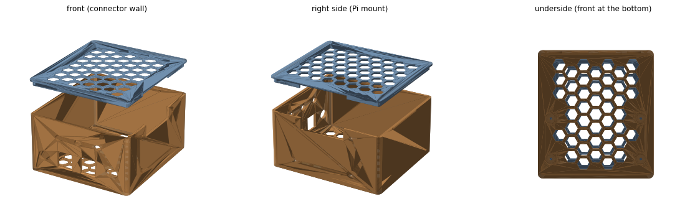
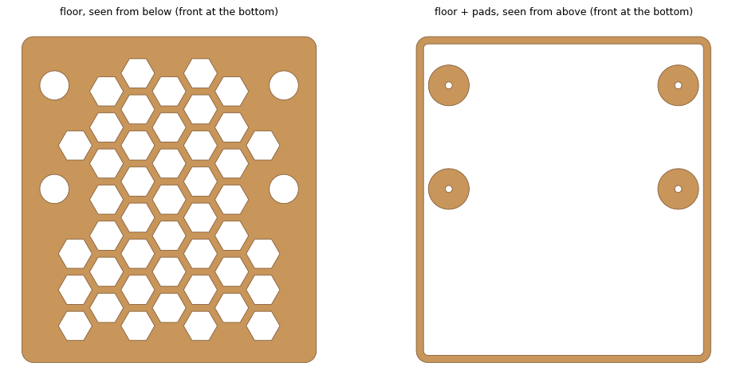
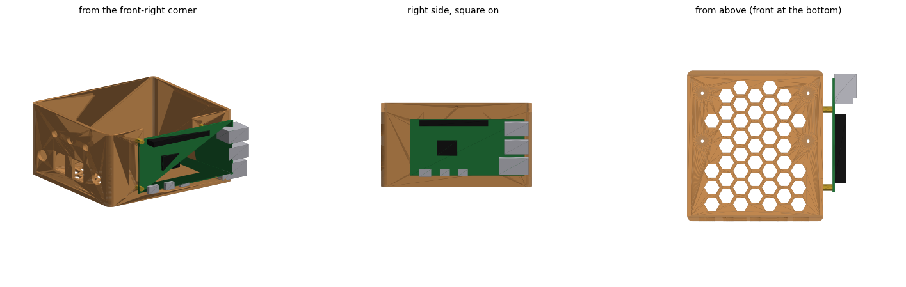

# Enclosure

A printed box for the ADC/AUX board stack, with the Raspberry Pi 5 on its
right-hand wall. Outside 101 × 112 × 74 mm (base) plus an 8 mm lid; 2.5 mm walls.

| File | What |
|---|---|
| `box_base.stl`, `box_lid.stl` | The box |
| `fit_test.stl` | One keystone, DC jack and button opening on a 2.5 mm plate: print this first |
| `box.py` | Generates both STLs and `box.png`, `box_floor.png` (all dimensions are settings at the top) |
| `parts.py` | Keystone socket and jack hole geometry, shared by `box.py` and `fit_test.py` |
| `fit_test.py` | Generates `fit_test.stl` |
| `pi_mount_view.py` | Renders a rough Pi 5 on the wall (`pi_mount.png`) to check the mount |

**Front wall**, left to right: VIN jack (12 V adapter in), AUX keystone (CTL),
ADC keystone (SIG), VOUT jack (the sensor's power lead), and the
LOCK / UNLOCK / CENTRE buttons above (7 mm). Keystones snap in from inside,
latch up.

**Floor:** four 14 mm pads under the board's corner holes (78.7 × 35.6 mm).
M2 standoffs with a 4 mm stud stand on them, the stud through the floor and a
nut from below in a 10 mm pocket; the stud ends flush with the bottom.

**Pi mount:** the same standoffs through the right wall (Pi 5 hole pattern
58 × 49 mm), nuts inside. Component side out, GPIO header at the top: the
wires go over the board's top edge into an open-topped slot, which the lid
closes. USB/Ethernet face the back; USB-C faces down, 12 mm above the table,
so use a right-angle adapter.

**Floor and lid** are honeycombed (10 mm hexes). The lid's inner lip has six
bumps that click into dimples in the walls; it fits one way round, with its
lip gap over the Pi slot. `LIP_GAP` (0.05 mm) and `DET_H` (0.4 mm) set how
tight; adjust for your printer.

**Printing:** base upright, open side up, no supports; lid flat face down;
fit test outer face down. Requires `numpy`, `trimesh`, `shapely`,
`matplotlib` to regenerate.

